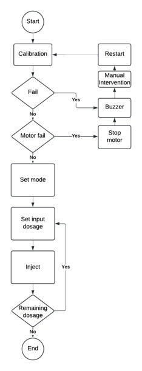
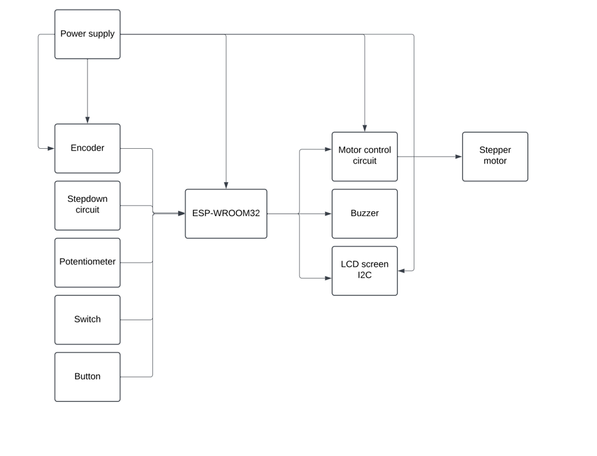
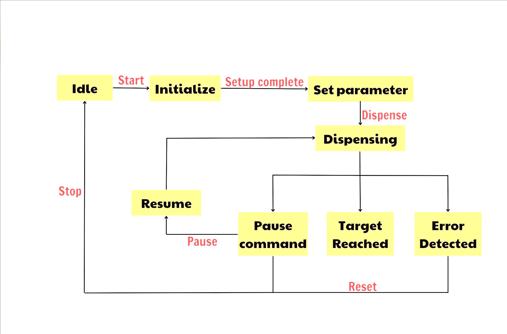

# Syringe Pump Project using Arduino

## Overview

This project demonstrates the design and implementation of a **syringe pump** using an ESP 32 microcontroller. Syringe pumps are precise devices commonly used in laboratories, medical applications, and fluid handling systems to deliver specific volumes of liquid at controlled flow rates. By leveraging Arduino's flexibility and affordability, this project provides a cost-effective and customizable alternative to commercial syringe pumps.

## Features

- **Precision Control**: Adjust flow rates and volume with high accuracy.
- **User-Friendly Interface**: Simple controls using push buttons, a rotary encoder, or a touchscreen.
- **Customizable Design**: Easily modify the code and hardware for different syringe sizes and flow rate requirements.
- **Stepper Motor Integration**: Smooth and precise linear motion for consistent liquid dispensing.

## Components

- ESP 32 Board
- Stepper motor and gearbox
- 3D-printed syringe holder
- Encoder
- Potentiometer
- Switch
- Button
- Buzzer
- Syringe 
- Power supply
- Optional: LCD or OLED display for user interface

## Applications

- Laboratory experiments
- Medical fluid delivery
- Microfluidics and chemical dispensing
- DIY automation projects

This project is ideal for students, hobbyists, and researchers looking to explore the intersection of microcontrollers and fluid mechanics.
## Flow chart

## Block diagram

## State Diagram

